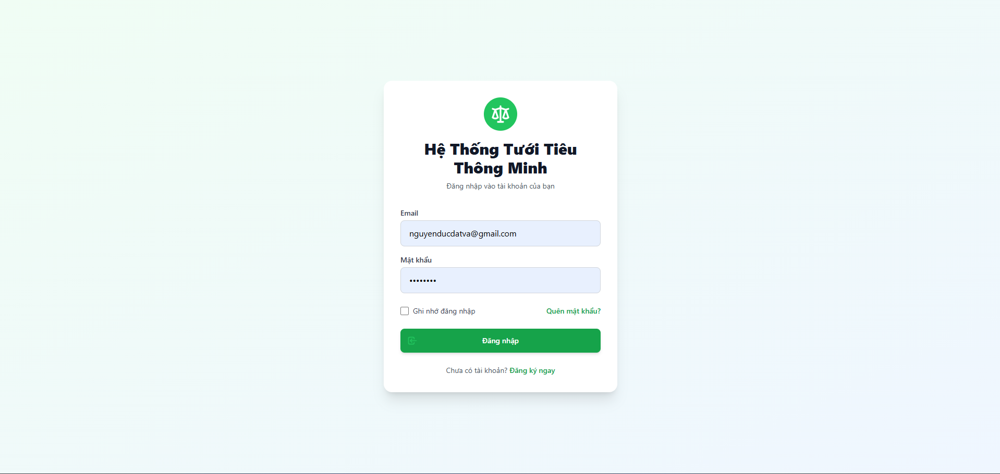
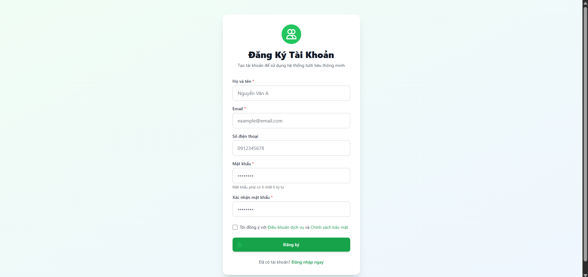
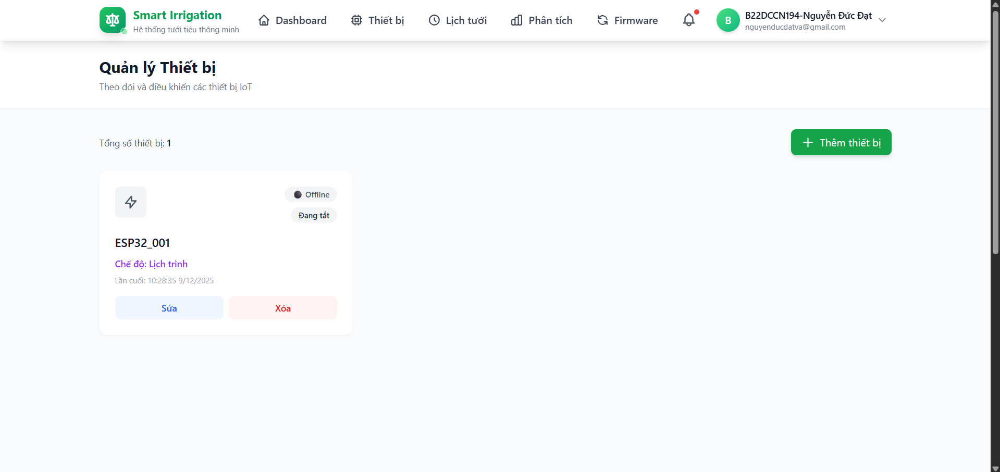
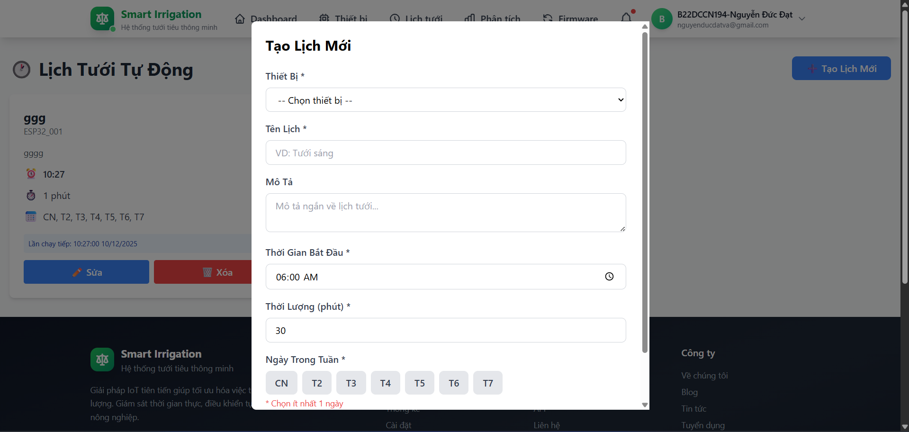
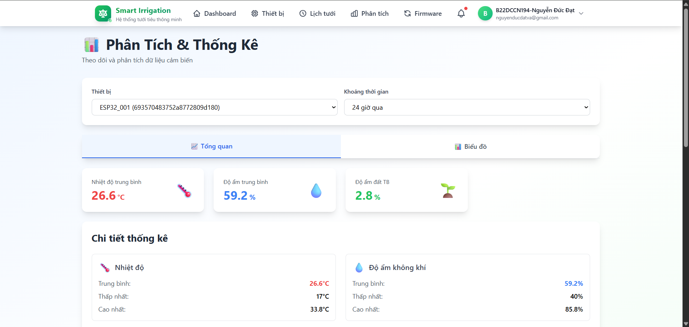
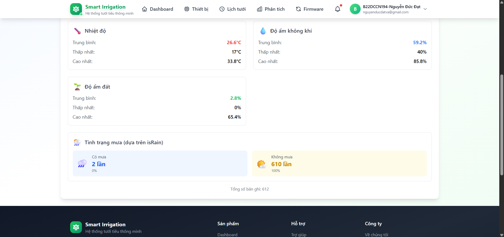
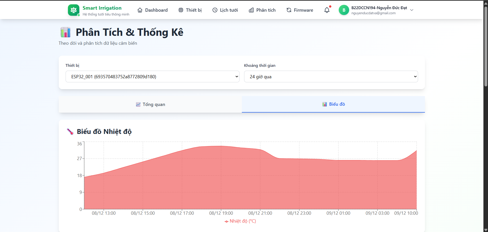
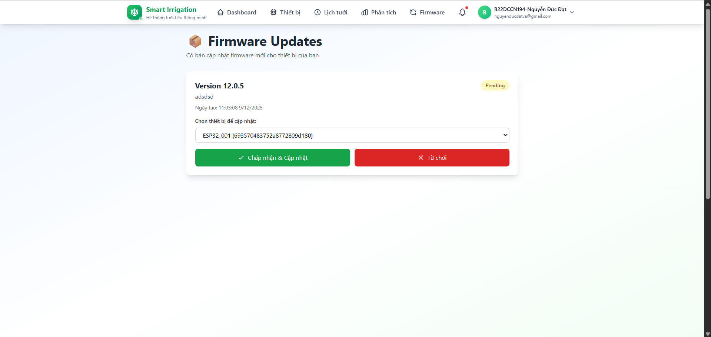
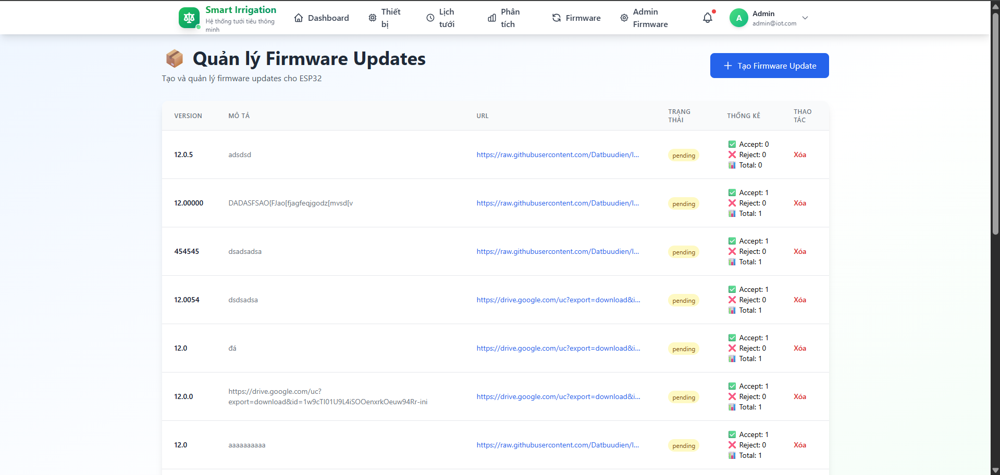
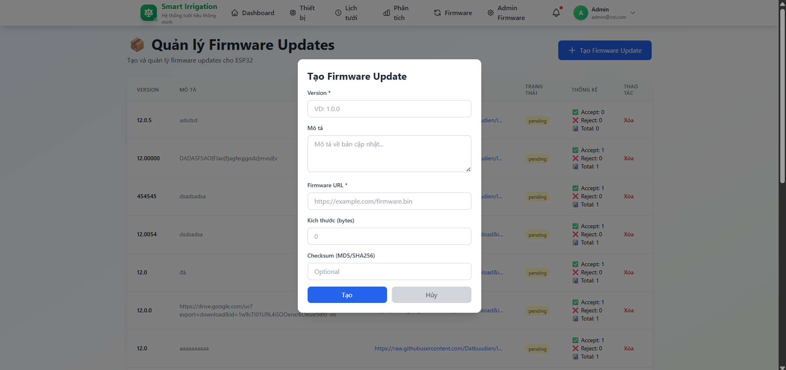

# 🌐 Hệ thống IoT - Giám sát và Điều khiển Thiết bị Thông minh

Hệ thống IoT toàn diện cho phép giám sát cảm biến, điều khiển thiết bị từ xa và quản lý thông qua giao diện web hiện đại.

## 👥 Thông tin nhóm

### Giảng viên hướng dẫn
- **Kim Ngọc Bách**

### Thành viên nhóm

| Họ và tên | Mã sinh viên |
|-----------|-------------|
| Nguyễn Đức Đạt | B22DCCN194 |
| Lưu Minh Hiển | B22DCCN290 |
| Nguyễn Đức Khởi | B22DCCN470 |
| Vũ Hồng Linh | B22DCCN494 |

## 🚀 Demo & Deployment

- **Frontend**: [https://iot-2xl4agcfh-napersaus-projects.vercel.app/](https://iot-2xl4agcfh-napersaus-projects.vercel.app/)
- **Backend**: Deployed on Render
- **Database**: MongoDB Atlas

## 🛠️ Công nghệ sử dụng

### Backend
- **Runtime**: Node.js
- **Framework**: Express.js
- **Database**: MongoDB (MongoDB Atlas)
- **Authentication**: JWT (JSON Web Tokens)
- **IoT Protocol**: MQTT
- **Validation**: Joi
- **Security**: bcryptjs

### Frontend
- **Framework**: React.js 19.1.1
- **Routing**: React Router DOM 7.9.6
- **Styling**: Tailwind CSS
- **Charts**: Recharts 3.4.1
- **HTTP Client**: Axios
- **Build Tool**: React Scripts

### Firmware
- **Platform**: ESP32
- **IDE**: Arduino IDE
- **Sensors**: DHT (Temperature/Humidity), Light sensors
- **Communication**: WiFi, MQTT

## 📁 Cấu trúc dự án

```
IOT/
├── src/
│   ├── backend/          # Server API
│   │   ├── config/       # Cấu hình database, CORS, MQTT
│   │   ├── controllers/  # Business logic
│   │   ├── models/       # MongoDB schemas
│   │   ├── routes/       # API endpoints
│   │   ├── middleware/   # Auth, error handling
│   │   ├── mqtt/         # MQTT handlers
│   │   ├── services/     # MQTT & Scheduler services
│   │   └── scripts/      # Utility scripts
│   │
│   ├── frontend/         # React web app
│   │   ├── public/       # Static files
│   │   └── src/
│   │       ├── components/  # Reusable components
│   │       ├── pages/       # Page components
│   │       ├── services/    # API services
│   │       └── routes/      # Route configuration
│   │
│   └── firmware/         # ESP32 code
│       ├── main/         # Main firmware
│       └── voice_control/ # Voice control module
│
└── doc/                  # Documentation
```

## ✨ Tính năng chính

### 1. Quản lý Thiết bị
- ✅ Thêm, sửa, xóa thiết bị
- ✅ Giám sát trạng thái thiết bị real-time
- ✅ Điều khiển thiết bị từ xa qua MQTT

### 2. Thu thập Dữ liệu Cảm biến
- ✅ Nhiệt độ, độ ẩm, ánh sáng
- ✅ Lưu trữ dữ liệu tự động
- ✅ Hiển thị biểu đồ trực quan

### 3. Phân tích & Thống kê
- ✅ Dashboard tổng quan
- ✅ Biểu đồ lịch sử dữ liệu
- ✅ Thống kê theo thời gian

### 4. Lập lịch Tự động
- ✅ Tạo lịch bật/tắt thiết bị
- ✅ Lịch định kỳ theo ngày trong tuần
- ✅ Quản lý múi giờ

### 5. Cập nhật Firmware OTA
- ✅ Upload firmware từ web
- ✅ Cập nhật qua MQTT
- ✅ Theo dõi tiến trình

### 6. Xác thực & Phân quyền
- ✅ Đăng ký, đăng nhập
- ✅ JWT Authentication
- ✅ Phân quyền Admin/User

### 7. Tích hợp API Thời tiết
- ✅ Dữ liệu thời tiết real-time
- ✅ Tích hợp vào dashboard

## 📸 Sản phẩm sau khi hoàn thiện

### Giao diện Web Application

<div align="center">

#### 1. Trang Đăng nhập


#### 2. Trang Đăng ký


#### 3. Dashboard Tổng quan


#### 4. Quản lý Thiết bị


#### 5. Lập lịch Tự động


#### 6. Phân tích & Thống kê


#### 7. Phân tích & Thống kê


#### 8. Phân tích & Thống kê


#### 9. Cập nhật Firmware


#### 10. Cập nhật Firmware Admin


#### 11. Cập nhật Firmware Admin


</div>

---

## 🔧 Cài đặt & Chạy dự án

### Yêu cầu hệ thống
- Node.js >= 14.x
- npm hoặc yarn
- MongoDB
- MQTT Broker (HiveMQ, Mosquitto, etc.)
- Arduino IDE (cho firmware)

### 1. Backend

```bash
cd src/backend

# Cài đặt dependencies
npm install

# Tạo file .env
cp .env.example .env

# Cập nhật thông tin trong .env:
# MONGODB_URI=your_mongodb_connection_string
# JWT_SECRET=your_secret_key
# MQTT_BROKER_URL=your_mqtt_broker
# PORT=3000

# Chạy server
npm start

# Hoặc chạy development mode
npm run dev
```

### 2. Frontend

```bash
cd src/frontend

# Cài đặt dependencies
npm install

# Cập nhật API URL trong src/config/api.js

# Chạy ứng dụng
npm start
```

### 3. Firmware

```bash
# Mở file src/firmware/main/main.ino trong Arduino IDE
# Cập nhật thông tin WiFi và MQTT trong Config.h
# Chọn board ESP32
# Upload code lên ESP32
```

## 📝 API Endpoints

### Authentication
- `POST /api/auth/register` - Đăng ký tài khoản
- `POST /api/auth/login` - Đăng nhập

### Devices
- `GET /api/devices` - Lấy danh sách thiết bị
- `POST /api/devices` - Thêm thiết bị mới
- `PUT /api/devices/:id` - Cập nhật thiết bị
- `DELETE /api/devices/:id` - Xóa thiết bị
- `POST /api/devices/:id/control` - Điều khiển thiết bị

### Sensor Data
- `GET /api/sensor-data` - Lấy dữ liệu cảm biến
- `GET /api/sensor-data/latest` - Dữ liệu mới nhất
- `GET /api/sensor-data/stats` - Thống kê

### Schedules
- `GET /api/schedules` - Lấy danh sách lịch
- `POST /api/schedules` - Tạo lịch mới
- `PUT /api/schedules/:id` - Cập nhật lịch
- `DELETE /api/schedules/:id` - Xóa lịch

### Analytics
- `GET /api/analytics/overview` - Tổng quan hệ thống
- `GET /api/analytics/device-usage` - Thống kê sử dụng thiết bị

### Firmware
- `GET /api/firmware` - Danh sách firmware
- `POST /api/firmware/upload` - Upload firmware
- `GET /api/firmware/:version/download` - Tải firmware

### Weather
- `GET /api/weather` - Dữ liệu thời tiết

## 🔐 Bảo mật

- ✅ JWT Authentication cho tất cả API endpoints
- ✅ Password hashing với bcrypt
- ✅ CORS configuration
- ✅ Input validation với Joi
- ✅ Error handling middleware
- ✅ Role-based access control

## 📊 Database Schema

### Users
- email, password, name, role, createdAt

### Devices
- name, type, status, deviceId, userId, createdAt

### SensorData
- deviceId, temperature, humidity, light, timestamp

### Schedules
- deviceId, action, time, daysOfWeek, isActive, timezone

### FirmwareUpdates
- version, filename, size, uploadedBy, createdAt

## 🌐 MQTT Topics

- `iot/devices/{deviceId}/control` - Điều khiển thiết bị
- `iot/devices/{deviceId}/status` - Trạng thái thiết bị
- `iot/devices/{deviceId}/sensor` - Dữ liệu cảm biến
- `iot/firmware/update` - Cập nhật firmware

## 📦 Scripts hữu ích

```bash
# Backend
npm run dev              # Chạy với nodemon
npm run dev:full         # Chạy server + fake data
npm run fake             # Tạo dữ liệu giả cho testing

# Frontend
npm start                # Chạy development server
npm run build            # Build production
npm test                 # Chạy tests
```

## 🐛 Debugging

### Tạo admin user
```bash
cd src/backend/scripts
node createAdmin.js
```

### Xóa dữ liệu cũ
```bash
cd src/backend/scripts
node deleteOldData.js
```

## 📱 Responsive Design

Website được thiết kế responsive, hoạt động tốt trên:
- 💻 Desktop
- 📱 Mobile
- 📱 Tablet

## 🤝 Contributing

Để đóng góp vào dự án:

1. Fork repository
2. Tạo branch mới (`git checkout -b feature/AmazingFeature`)
3. Commit changes (`git commit -m 'Add some AmazingFeature'`)
4. Push to branch (`git push origin feature/AmazingFeature`)
5. Tạo Pull Request

## 📄 License

Dự án này được phát triển cho mục đích học tập.

## 📞 Liên hệ

Nếu có thắc mắc, vui lòng liên hệ qua:
- Email: [Thông tin sinh viên]
- GitHub: [Repository link]

---

**Lưu ý**: Đây là dự án học tập, không sử dụng cho mục đích thương mại.
